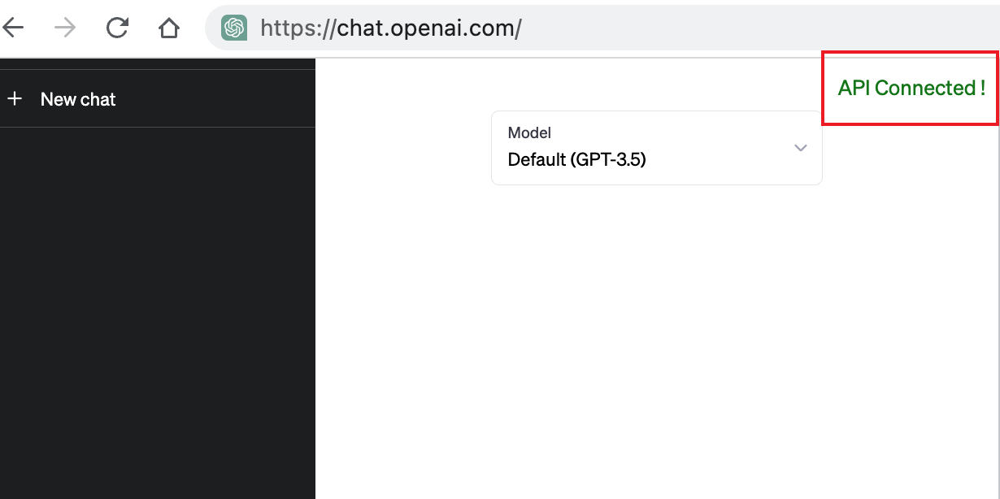

# Chatgpt API By Browser Script

[中文文档](./README.zh.md)

This project runs on users' browsers through the Tampermonkey script and converts the web version of ChatGPT operations into an API interface. You can use this API to do some interesting things, such as playing [Auto-GPT](https://github.com/Significant-Gravitas/Auto-GPT).

## Update

2024-05-19: Support new version UI and gpt-4o.

## Features
- API no cost.
- If you have a chatgpt plus account, you can use gpt-4 api.
- Having unlimited context.
- Not easy to be banned and easier to handle errors.


## Usage

### Step 1 Installation and Configuration

1. Make sure your system has installed Node.js and npm.
2. Clone this repository and run `npm install` in the project directory to install dependencies.
3. Run `npm run start` to start the Node.js server.
4. Alternatively, you can use Docker `docker-compose up` to start the Node.js server.

### Step 2 Use Tampermonkey

1. Install [Tampermonkey](https://www.tampermonkey.net/) browser extension.
2. Open Tampermonkey management panel and create a new script.
3. Copy the contents of `tampermonkey-script.js` file into the newly created script and save it.

### Step 3 Download and Install the Browser Extension Disable Content-Security-Policy

Download from [here](https://chromewebstore.google.com/detail/disable-content-security/ieelmcmcagommplceebfedjlakkhpden)

### Step 4 Open and Log in to ChatGPT

[https://chat.openai.com/](https://chat.openai.com/)

If you see this in the upper right corner of the webpage, you have succeeded !




### Step 5 Run the script

Execute the Node.js program to process all prompts:

```bash
npm start
```

The answers will be saved to `answers.txt` and a chart of response times will be written to `response-times.png`.
